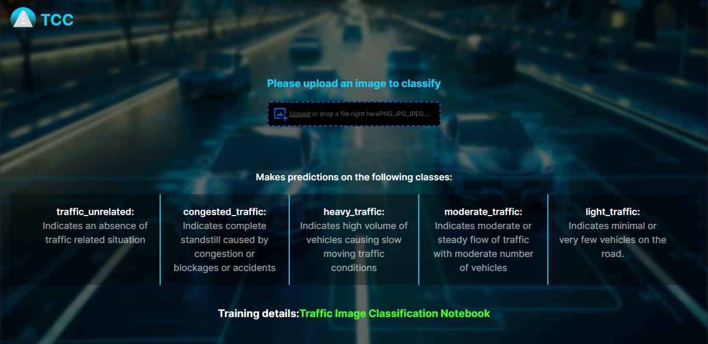
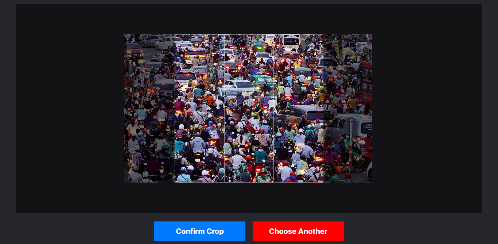
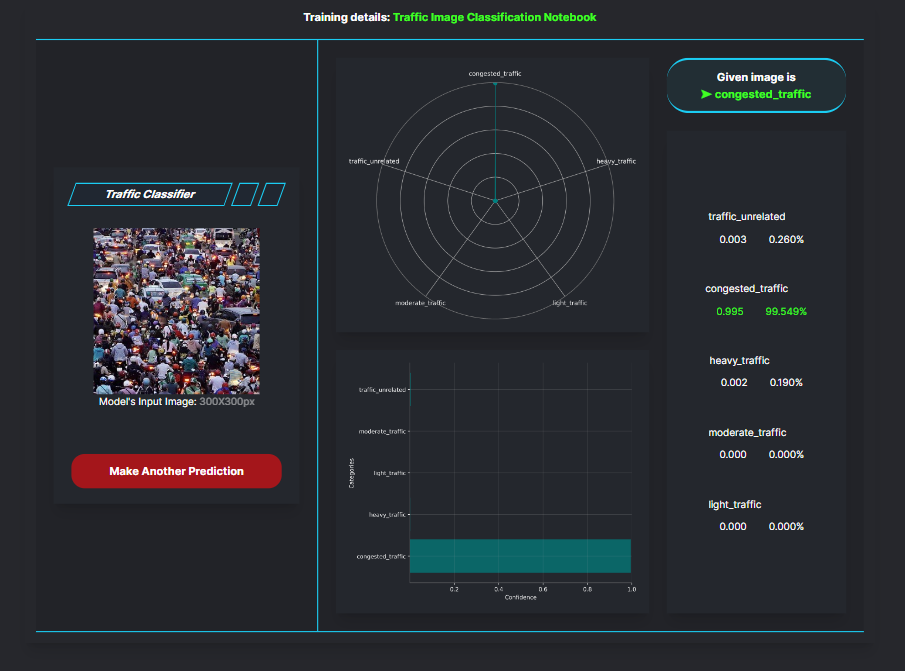
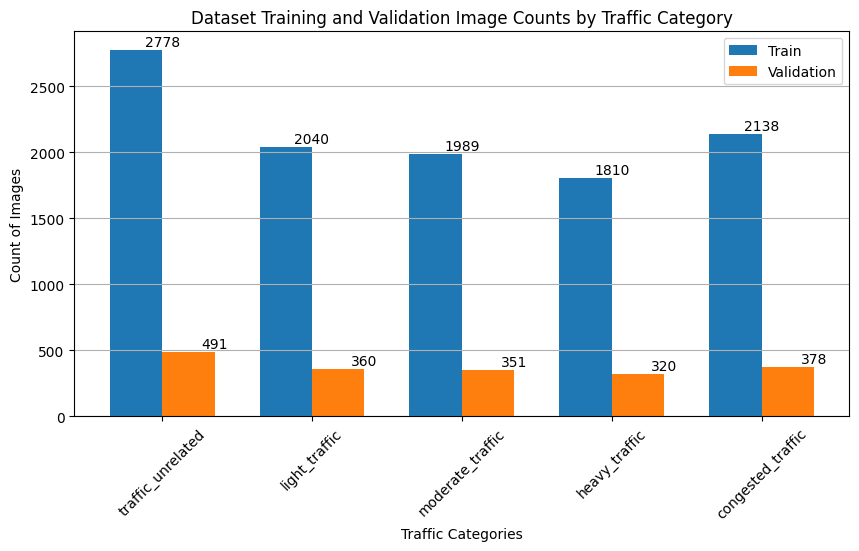
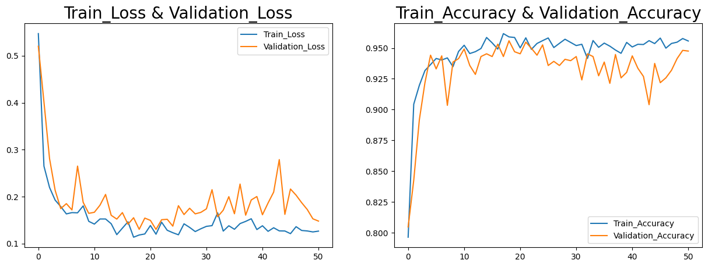

# traffic-image-classifier

> #### TASKS PERFORMED 🡆 Data Collection (Manual, Web Scrapping)✅, Exploratory Data Analysis✅, Data Augmentation✅, Model Training (ML Algorithms, CNN, Transfer Learning)✅, Hyperparameter Tuning✅, Model Validation✅, Deployment (UI Design, React and FastAPI)✅

<p align="center">
  
</p>

Upload images and make classification on:

- `traffic_unrelated`: Indicates an absence of traffic related situation
- `congested_traffic`: Indicates complete standstill caused by congestion or blockages or accidents
- `heavy_traffic`: Indicates high volume of vehicles causing slow moving traffic conditions
- `moderate_traffic`: Indicates moderate or steady flow of traffic with moderate number of vehicles
- `light_traffic`: Indicates minimal or very few vehicles on the road

For more details on the model training process, please visit the Kaggle project [here](https://www.kaggle.com/code/abhashrai/traffic-congestion-prediction-cnn-xception/).

# Table of Content

- [Prerequisites](#prerequisites)
- [Demo](#demo)
- [Usage](#usage)
- [Model Summary](#model-summary)
- [Model Evaluation](#model-evaluation)
- [Acknowledgement](#acknowledgement)

# Prerequisites

- You must have `Python 3` installed on your system.
- You must have `Git` installed on your system.
- You must have `Git LFS` installed on your system (for cloning/downloading pre-trained model file).
- **(Optional)** You should have `Node.js` (npm) installed on your system (if using development server)

# Demo

<h4 align="center">
  <b>Step 1: Upload an image ↓</b>
</h4>



<h4 align="center">
  <b>Step 2: Crop the image into square ratio ↓</b>
</h4>



<h4 align="center">
  <b>Step 3: Get the results ↓</b>
</h4>



# Usage

1. Clone the repository (In terminal):

    ```
    git clone https://github.com/AbhashChamlingRai/traffic-image-classifier.git
    ```

2. Enter into the project directory:

    ```
    cd traffic-image-classifier
    ```

    > Before following the below procedure, go to <a href='https://drive.google.com/file/d/1ytKJ1jTt6GEtDOpTHRtWaNHQIAaRSHPF/view?usp=sharing'>this link</a> and download the model `traffic_classifier.h5` and place it into the `/traffic-image-classifier` directory.
    
3. Install the required dependencies:

    ```
    pip install -r requirements.txt
    ```

4. Start Fast-API:

   Open `/fastapi` directory in your terminal. Then run the below command and wait until you see the message `Application startup complete.` in your terminal:

    ```
    uvicorn main:app --port 8000 --reload
    ```

5. Run React App:

   Open `/react-app-build/index.html` file in your browser. Upload images in the web app and make predictions.

6. **(Optional)** If you want to run development server:

   Open `/react-app-development` directory in your terminal. Then install project dependencies using `npm install` command. Wait until installation process completes, then run the development server by running the command `npm start`.

# Model Summary

```Python
_________________________________________________________________
 Layer (type)                Output Shape              Param #   
=================================================================
 input_4 (InputLayer)        [(None, 300, 300, 3)]     0         
                                                                 
 tf.cast_1 (TFOpLambda)      (None, 300, 300, 3)       0         
                                                                 
 tf.math.truediv_1 (TFOpLamb  (None, 300, 300, 3)      0         
 da)                                                             
                                                                 
 tf.math.subtract_1 (TFOpLam  (None, 300, 300, 3)      0         
 bda)                                                            
                                                                 
 xception (Functional)       (None, 2048)              20861480  
                                                                 
 batch_normalization_11 (Bat  (None, 2048)             8192      
 chNormalization)                                                
                                                                 
 dense_3 (Dense)             (None, 368)               754032    
                                                                 
 batch_normalization_12 (Bat  (None, 368)              1472      
 chNormalization)                                                
                                                                 
 dense_4 (Dense)             (None, 112)               41328     
                                                                 
 batch_normalization_13 (Bat  (None, 112)              448       
 chNormalization)                                                
                                                                 
 dropout_1 (Dropout)         (None, 112)               0         
                                                                 
 dense_5 (Dense)             (None, 5)                 565       
                                                                 
=================================================================
Total params: 21,667,517
Trainable params: 800,981
Non-trainable params: 20,866,536
_________________________________________________________________
```

The model needs a 300x300 pixel color image represented a NumPy array with RGB (3 channels). So, the input array must be of shape (1, 300, 300, 3). You don't have to worry about normalizing the pixel values (scaling by 1/255) because the first four layers of the model take care of it.

# Model Evaluation



The data has been partitioned into three sets for training, and validation, each containing samples from five distinct classes. The split ratios are as follows: 85% for training, 15% for validation. Despite the limited data, the model successfully met my expectations:

> #### For validation data:

```Python
score, acc = model.evaluate(validation_generator)
print('Test Loss =', score)
print('Test Accuracy =', acc)

Output:
8/8 [==============================] - 12s 1s/step - loss: 0.1525 - accuracy: 0.9468
Test Loss = 0.15245917439460754
Test Accuracy = 0.9468421339988708
```

```Python
Confusion Matrix:
[[350  15   1  11   1]
 [ 14 290   1  15   0]
 [  1   1 345  11   2]
 [  5  12   2 332   0]
 [  4   0   5   0 482]]

Classification Report:
              precision    recall  f1-score   support

           0       0.94      0.93      0.93       378
           1       0.91      0.91      0.91       320
           2       0.97      0.96      0.97       360
           3       0.90      0.95      0.92       351
           4       0.99      0.98      0.99       491

    accuracy                           0.95      1900
   macro avg       0.94      0.94      0.94      1900
weighted avg       0.95      0.95      0.95      1900
```

> #### For train data:

```Python
score, acc = model.evaluate(train_generator)
print('Test Loss =', score)
print('Test Accuracy =', acc)

Output:
43/43 [==============================] - 239s 6s/step - loss: 0.0883 - accuracy: 0.9695
Test Loss = 0.08829263597726822
Test Accuracy = 0.9695025682449341
```

```Python
Confusion Matrix:
[[2055   48   11   21    3]
 [  57 1711    5   36    1]
 [   4    3 2001   27    5]
 [  18   35   14 1920    2]
 [   3    1    4    4 2766]]

Classification Report:
              precision    recall  f1-score   support

           0       0.96      0.96      0.96      2138
           1       0.95      0.95      0.95      1810
           2       0.98      0.98      0.98      2040
           3       0.96      0.97      0.96      1989
           4       1.00      1.00      1.00      2778

    accuracy                           0.97     10755
   macro avg       0.97      0.97      0.97     10755
weighted avg       0.97      0.97      0.97     10755
```



# Acknowledgement

Special thanks to Asha Limbu for her work in creating the UI/UX design.

- Follow Asha on [LinkedIn](https://www.linkedin.com/in/ashalimbu/)
- Connect with her on [GitHub](https://github.com/asha-limbu)
